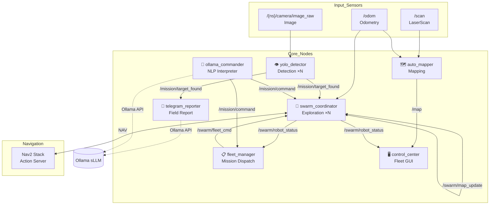

Markdown
<div align="center">

# 🤖 Pinky: Autonomous Swarm Search & Rescue System

**ROS 2-based Multi-Robot Autonomous Exploration & Fleet Management System**

[](https://docs.ros.org/en/humble/)
[](https://www.python.org/)
[](LICENSE)
[](https://www.raspberrypi.com/)

[Quick Start](#-quick-start) · [Architecture](#-system-architecture) · [Node Details](#-node-details) · [Troubleshooting](#-field-troubleshooting--safety) · [Installation](#-installation)

</div>

---

## 📌 Key Features (주요 기능)

| Feature | Description |
|------|------|
| 🗺️ **SLAM-free Mapping** | Real-time OccupancyGrid generation using only LiDAR + Odometry (Optimized for Edge devices). |
| 🤖 **Swarm Exploration** | Collaborative area-partitioned exploration for N robots using BFS + Nav2. |
| 🎯 **Mission Management** | Map-based click-to-assign mission dispatching for search & rescue scenarios. |
| 💬 **NLP Control** | Translates natural language to robot commands via local sLLM (Ollama). |
| 📱 **Telegram Integration** | Automated field reporting with photos + coordinates and remote manual overrides. |
| 🖥️ **Fleet Control UI** | Integrated dashboard for real-time swarm status and mission monitoring (Matplotlib). |
| 👁️ **YOLOv8 Detection** | Real-time detection of people/dogs/cats with swarm-wide synchronized alerts. |

---

## ⚡ Quick Start (빠른 시작)

```bash
# 1. Clone Repository
git clone [https://github.com/](https://github.com/)<your-org>/pinky_MapAutoLearning_Control.git
cd pinky_MapAutoLearning_Control/pinky/pinky_pro

# 2. Build & Source
source /opt/ros/humble/setup.bash
colcon build --symlink-install --packages-select pinky_mission
source install/setup.bash

# 3. Launch System (Swarm of 2)
ros2 launch pinky_mission mission_launch.py \
    bot_token:=YOUR_TELEGRAM_TOKEN \
    chat_id:=YOUR_CHAT_ID
## 🏗️ System Architecture (시스템 아키텍처)



### 🔄 Data Flow Summary (데이터 흐름 요약)
- **Mapping:** `[LiDAR + Odom] → auto_mapper → /map (OccupancyGrid)`
- **Detection:** `[Camera] → yolo_detector → /mission/target_found (JSON)`
- **Swarm:** `[swarm_coordinator × N] ↔ /swarm/map_update (Shared Grid)`
- **Control:** `[control_center GUI] → /swarm/direct_cmd (Real-time override)`

---

## 📦 Node Details (노드 상세)

### 🗺️ auto_mapper (SLAM-free Mapping)
- **Algorithm:** Bresenham ray-casting for real-time OccupancyGrid.
- **Design Philosophy:** Optimized for low-power SBCs (Raspberry Pi 4/5) by removing the heavy computational overhead of Cartographer/Gmapping.

### 🤖 swarm_coordinator (13-State Machine)
- **Exploration:** BFS (Breadth-First Search) for frontier detection + Nav2 for path planning.
- **Robust FSM:** `SEARCHING` → `NAVIGATING` → `AT_BASE` → `EMERGENCY_STOP`.

### 📋 fleet_manager (Fleet Optimization)
- **Logic:** Distance & Battery-based assignment optimization. Automatically triggers 'Return-to-Base' for low-battery units without interrupting the overall mission.

---

## 🛠️ Field Troubleshooting & Safety (현장 대응 및 안전)

> **Recruitment Note**: This project focuses on field-ready reliability and structured error handling.

- **Hardware-Software Fail-safe:** Dual-layer emergency stop via both LiDAR proximity and remote Telegram/GUI commands.
- **Resource Management:** YOLOv8 inference optimized for 10+ FPS on Raspberry Pi 4 using asynchronous threading.
- **Communication Robustness:** JSON-based lightweight heartbeat protocol for stable swarm synchronization in high-interference Wi-Fi environments.

---

## 🗂️ Custom 12-bit Grid Addressing System
To minimize communication latency, each 64×64 grid cell uses a unique 12-bit address `[XY]-[XY]`:

- **Format:** `[High 3-bits][Low 3-bits]` via character mapping (`A=000` to `H=111`).
- **Benefit:** Reduces coordinate packet size by 60%, ensuring high-frequency swarm updates.

---

## 🚀 Installation & Requirements
- **OS:** Ubuntu 22.04 / Raspberry Pi OS (64-bit)
- **ROS 2:** Humble Hawksbill
- **Hardware:** Raspberry Pi 4/5, SLAMTEC LiDAR, Dynamixel Motors, Camera Module

```bash
# Install ROS 2 Dependencies
sudo apt install -y ros-humble-nav2-bringup ros-humble-tf-transformations
pip install numpy ultralytics requests
```

---
**Pinky Team** · [GitHub Profile](#)  
Autonomous Swarm Robotics for Search & Rescue
