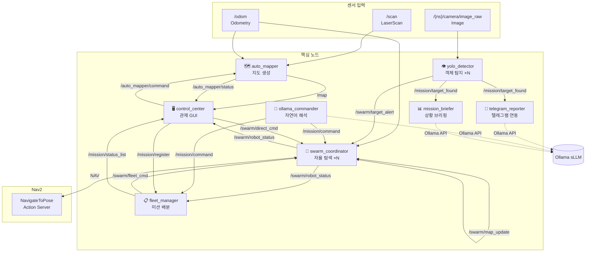

<div align="center">

# 🤖 Pinky MapAutoLearning & Control

**ROS 2 기반 다중 로봇 자율 탐색·관제 시스템**

[](https://docs.ros.org/en/humble/)
[](https://www.python.org/)
[](LICENSE)
[](https://www.raspberrypi.com/)

[빠른 시작](#-빠른-시작) · [아키텍처](#-시스템-아키텍처) · [노드 목록](#-노드-상세) · [설치](#-설치) · [기여하기](#-기여하기)

</div>

---

## 📌 무엇을 할 수 있나요?

| 기능 | 설명 |
|------|------|
| 🗺️ **SLAM-free 지도 생성** | LiDAR + Odometry만으로 OccupancyGrid 실시간 작성 |
| 🤖 **군집 자율 탐색** | N대의 로봇이 구역을 분할하여 협력 탐색 (BFS + Nav2) |
| 🎯 **미션 관리** | 실종신고 · 유기견 · 유기묘 등 미션을 지도에서 클릭 등록·배분 |
| 💬 **자연어 제어** | Ollama sLLM으로 한국어 명령을 로봇 동작으로 변환 |
| 📱 **텔레그램 연동** | 탐지 현장 사진+좌표 자동 보고 / 텔레그램으로 로봇 원격 제어 |
| 🖥️ **실시간 관재 UI** | Matplotlib 기반 군집 지도·상태·미션 통합 대시보드 |
| 👁️ **YOLOv8 탐지** | 사람·개·고양이 실시간 감지 후 전체 군집에 위치 경보 |

---

## ⚡ 빠른 시작

```bash
# 1. 저장소 클론
git clone https://github.com/<your-org>/pinky_MapAutoLearning_Control.git
cd pinky_MapAutoLearning_Control/pinky/pinky_pro

# 2. ROS 2 환경 설정
source /opt/ros/humble/setup.bash

# 3. 빌드
colcon build --symlink-install --packages-select pinky_mission
source install/setup.bash

# 4. 전체 시스템 실행 (2대 군집)
ros2 launch pinky_mission mission_launch.py \
    bot_token:=YOUR_TELEGRAM_TOKEN \
    chat_id:=YOUR_CHAT_ID

# 5. 관재 UI 실행 (별도 터미널)
ros2 run pinky_mission control_center
```

---

## 🏗️ 시스템 아키텍처



### 토픽 흐름 요약

```
[LiDAR + Odom] → auto_mapper → /map (OccupancyGrid, TRANSIENT_LOCAL)
                             → /auto_mapper/status (JSON)

[Camera] → yolo_detector → /mission/target_found (JSON)
                         → /swarm/target_alert (경량 텍스트)

[swarm_coordinator × N] ↔ /swarm/map_update (격자 공유)
                        → /swarm/robot_status (JSON)
                        ← /swarm/fleet_cmd (SOLO_SEARCH | RETURN_NOW ...)
                        ← /swarm/direct_cmd (STOP | GOTO | WAYPOINTS ...)

[fleet_manager] ← /mission/register | /mission/command | /mission/complete
               → /swarm/fleet_cmd | /mission/status_list

[control_center GUI] → /auto_mapper/command | /swarm/direct_cmd | /mission/*
                     ← 모든 상태 토픽 (실시간 시각화)
```

---

## 📦 노드 상세

<details>
<summary><b>🗺️ auto_mapper — SLAM-free 자율 지도 생성</b></summary>

Bresenham ray-casting 알고리즘으로 LiDAR 데이터를 직접 OccupancyGrid에 투영합니다.
SLAM 없이 LiDAR + Odometry만으로 지도를 작성하며, 전진→회전 상태 기계로 자율 이동합니다.

**파라미터:**

| 이름 | 기본값 | 설명 |
|------|--------|------|
| `auto_start` | `true` | 즉시 시작 여부 |
| `map_size` | `400` | 격자 수 (400×400) |
| `map_resolution` | `0.05` | m/cell |
| `coverage_done_sec` | `60.0` | 완료 판단 지속 시간 |
| `min_new_cells` | `30` | 위 기간 최소 신규 셀 |
| `save_path` | `/tmp` | 지도 저장 경로 |

**원격 제어 명령** (`/auto_mapper/command`):
`START` · `STOP` · `PAUSE` · `RESUME` · `SAVE` · `RESET`

</details>

<details>
<summary><b>🤖 swarm_coordinator — 개별 로봇 자율 탐색 (13-State Machine)</b></summary>

각 로봇 인스턴스가 독립적으로 실행되며 Nav2 액션 클라이언트로 이동합니다.
BFS로 미탐색 셀을 찾고, 구역(zone) 기반으로 충돌 없이 역할을 분담합니다.

**상태 전이:**
```
SEARCHING → NAVIGATING_EXPLORE → SEARCHING
SOLO_SEARCH → NAVIGATING_SOLO → AT_BASE
DIRECT_GOTO → NAVIGATING_DIRECT → SEARCHING
WAYPOINT_FOLLOW → NAVIGATING_WAYPOINT → (다음 경유/SEARCHING)
RETURNING → NAVIGATING_RETURN → AT_BASE
PAUSED / EMERGENCY_STOP (명령 대기)
```

**파라미터:**

| 이름 | 기본값 | 설명 |
|------|--------|------|
| `robot_namespace` | `robot1` | 로봇 네임스페이스 |
| `robot_id` | `1` | 고유 ID |
| `num_robots` | `2` | 전체 로봇 수 (구역 분할용) |
| `world_width` | `500.0` | 실제 세계 너비 (m) |
| `world_height` | `150.0` | 실제 세계 높이 (m) |
| `nav_timeout_sec` | `30.0` | Nav2 타임아웃 |

</details>

<details>
<summary><b>📋 fleet_manager — 미션 배분 및 자동 균형 복귀</b></summary>

`DISPATCH_ALL` 명령 수신 시 PENDING 미션과 활성 로봇을 거리 기반으로 최적 매칭합니다.
미션보다 로봇이 많을 때 초과 로봇은 배터리 낮은 순으로 자동 복귀시킵니다.

**미션 등록 형식** (`/mission/register`):
```
{type}:{label}:{wx:.2f}:{wy:.2f}
예) 유기견:백구_1:120.00:50.00
```

**지원 미션 타입:** `실종신고` · `유기견` · `유기묘` · `치매 어르신 실종`

</details>

<details>
<summary><b>💬 ollama_commander — 자연어 명령 해석</b></summary>

Ollama REST API를 통해 로컬 sLLM에 한국어/영어 텍스트를 전달하고
구조화된 로봇 명령으로 변환합니다. 신뢰도 임계값 미만이면 `UNKNOWN` 처리합니다.

**지원 명령 예시:**
```
"1번 표지판을 찾아"     → FIND_TARGET:sign_1
"원점으로 돌아와"      → RETURN_TO_ORIGIN
"긴급 정지"            → EMERGENCY_STOP
"수색 재개해줘"        → RESUME_SEARCH
"상태 보고해"          → STATUS_REPORT
```

</details>

<details>
<summary><b>📱 telegram_reporter — 텔레그램 양방향 연동</b></summary>

탐지 이벤트 발생 시 현장 사진 + 12-bit 주소 + 좌표를 텔레그램으로 전송합니다.
폴링 방식으로 텔레그램 명령을 수신해 ROS 2 토픽으로 발행합니다.

**텔레그램 명령어:**
```
원점 복귀 / /home      → RETURN_TO_ORIGIN
긴급 정지 / /stop      → EMERGENCY_STOP
수색 재개              → RESUME_SEARCH
상태 보고 / /status    → STATUS_REPORT
```

</details>

---

## 🛠️ 설치

### 요구사항

- **OS**: Ubuntu 22.04 (Raspberry Pi OS 64-bit)
- **ROS 2**: Humble Hawksbill
- **Python**: 3.10+
- **하드웨어**: Raspberry Pi 4/5, SLAMTEC LiDAR, Dynamixel 모터, 카메라 모듈

### 의존성 설치

```bash
# ROS 2 패키지
sudo apt install -y \
    ros-humble-nav2-bringup \
    ros-humble-tf-transformations \
    ros-humble-cv-bridge \
    python3-colcon-common-extensions

# Python 패키지
pip install numpy ultralytics requests

# Ollama (AI 기능 사용 시)
curl -fsSL https://ollama.ai/install.sh | sh
ollama pull llama3   # 또는 gemma3, qwen2.5 등
```

### 하드웨어 빌드 (Raspberry Pi)

```bash
# Dynamixel SDK
cd ~/pinky_pro
colcon build --symlink-install --packages-select pinky_bringup

# SLAM LiDAR
colcon build --symlink-install --packages-select sllidar_ros2

# 전체 빌드
colcon build --symlink-install
```

---

## 🚀 실행 가이드

### 시나리오 1: 단일 로봇 자동 지도 작성

```bash
# 터미널 1: LiDAR 실행
ros2 launch sllidar_ros2 sllidar_a1_launch.py

# 터미널 2: BringUp (실제 하드웨어)
ros2 run pinky_bringup bringup

# 터미널 3: 자동 지도 생성
ros2 run pinky_mission auto_mapper \
    --ros-args -p auto_start:=true -p save_path:=/home/ubuntu/maps

# 터미널 4: 관재 UI (지도 확인)
ros2 run pinky_mission control_center
```

### 시나리오 2: 2대 군집 탐색 + 텔레그램 보고

```bash
ros2 launch pinky_mission mission_launch.py \
    num_robots:=2 \
    model_path:=yolov8n.pt \
    bot_token:=$PINKY_BOT_TOKEN \
    chat_id:=$PINKY_CHAT_ID \
    ollama_model:=llama3
```

### 자동 지도 원격 제어 (CLI)

```bash
# 지도 시작
ros2 topic pub --once /auto_mapper/command std_msgs/msg/String "data: 'START'"

# 지도 저장
ros2 topic pub --once /auto_mapper/command std_msgs/msg/String "data: 'SAVE'"

# 상태 확인
ros2 topic echo /auto_mapper/status
```

### 미션 등록 (CLI)

```bash
# 유기견 미션 등록 (좌표 120, 50)
ros2 topic pub --once /mission/register std_msgs/msg/String \
    "data: '유기견:백구_1:120.00:50.00'"

# 전체 출동
ros2 topic pub --once /mission/command std_msgs/msg/String \
    "data: 'DISPATCH_ALL'"
```

---

## 🗂️ 12-bit 격자 주소 체계

64×64 격자의 각 셀을 `[XY]-[XY]` 형식의 12-bit 주소로 표현합니다:

```
gx, gy → [<상위3비트><하위3비트>]-[<상위3비트><하위3비트>]
각 비트 그룹 → A(000) ~ H(111)

예) gx=10(=001 010), gy=36(=100 100)
  → [AB]-[EE]

실제 공간 환경(500m × 150m) 기준:
  격자 하나 = 7.8m × 2.3m
```

---

## ⚠️ 보안 주의사항

> **절대 커밋하지 마세요:** 텔레그램 Bot Token, Chat ID

```bash
# ✅ 권장: 환경변수로 전달
export PINKY_BOT_TOKEN="<your-token>"
export PINKY_CHAT_ID="<your-chat-id>"

# ❌ 금지: launch 파일이나 소스코드에 하드코딩
bot_token:=1234567890:ABCdef...  # 절대 커밋 금지!
```

`.gitignore`에 다음을 추가하세요:
```
.env
*.secret
pinky_pro/build/
pinky_pro/install/
pinky_pro/log/
```

---

## 🧪 테스트

```bash
cd pinky_pro
source install/setup.bash

# 전체 테스트
colcon test --packages-select pinky_mission

# 결과 확인
colcon test-result --verbose

# 특정 테스트만
python3 -m pytest src/pinky_pro/pinky_mission/test/ -v
```

---

## 📁 패키지 구조 (핵심)

```
pinky_mission/
├── launch/
│   └── mission_launch.py     # 전체 시스템 런치 (N로봇 동적 생성)
├── pinky_mission/
│   ├── auto_mapper.py        # SLAM-free 지도 생성 (400×400 grid)
│   ├── swarm_coordinator.py  # 개별 로봇 자율 탐색 (13-State SM)
│   ├── fleet_manager.py      # 미션 배분·관리 (거리+배터리 최적화)
│   ├── control_center.py     # Matplotlib 관재 GUI
│   ├── yolo_detector.py      # YOLOv8 탐지 (person/dog/cat)
│   ├── ollama_commander.py   # sLLM 자연어 명령 해석
│   ├── mission_briefer.py    # sLLM 탐색 브리핑 생성
│   └── telegram_reporter.py  # 텔레그램 양방향 연동
└── setup.py
```

---

## 🤝 기여하기

1. Fork → Feature branch (`git checkout -b feat/my-feature`)
2. 변경 사항 커밋 (`git commit -m 'feat: add my feature'`)
3. `colcon test` 통과 확인
4. Pull Request 생성

**커밋 메시지 규칙** (Conventional Commits):
```
feat: 새 기능
fix: 버그 수정
docs: 문서 수정
refactor: 리팩토링
test: 테스트 추가
chore: 빌드/설정 변경
```

---

## 📄 라이선스

Apache License 2.0 — 자세한 내용은 [LICENSE](LICENSE) 참조.

---

<div align="center">

**Pinky Team** · pinky@pinkab.art

*Autonomous Swarm Robotics for Search & Rescue*

</div>
