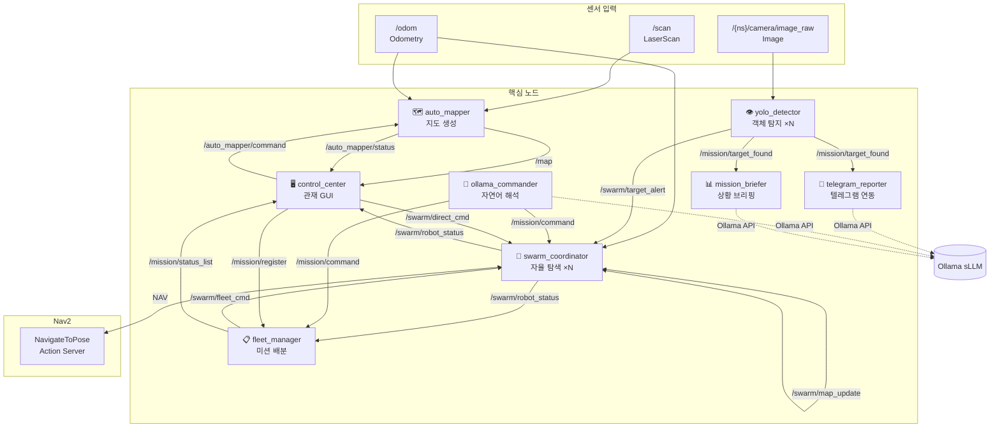

<div align="center">

# 🤖 Pinky: Autonomous Swarm Search & Rescue System

**ROS 2-based Multi-Robot Autonomous Exploration & Fleet Management System**

[](https://docs.ros.org/en/humble/)
[](https://www.python.org/)
[](LICENSE)
[](https://www.raspberrypi.com/)

[Quick Start](#-quick-start) · [Architecture](#-system-architecture) · [Node Details](#-node-details) · [Troubleshooting](#-field-troubleshooting--safety) · [Installation](#-installation)

</div>

---

## 📌 Key Features (주요 기능)

| Feature | Description |
|------|------|
| 🗺️ **SLAM-free Mapping** | Real-time OccupancyGrid generation using only LiDAR + Odometry (Optimized for Edge devices). |
| 🤖 **Swarm Exploration** | Collaborative area-partitioned exploration for N robots using BFS + Nav2. |
| 🎯 **Mission Management** | Map-based click-to-assign mission dispatching for search & rescue scenarios. |
| 💬 **NLP Control** | Translates natural language (Korean/English) to robot commands via local sLLM (Ollama). |
| 📱 **Telegram Integration** | Automated field reporting with photos + coordinates and remote manual overrides. |
| 🖥️ **Fleet Control UI** | Integrated dashboard for real-time swarm status and mission monitoring (Matplotlib). |
| 👁️ **YOLOv8 Detection** | Real-time detection of people/dogs/cats with swarm-wide synchronized alerts. |

---

## ⚡ Quick Start (빠른 시작)

```bash
# 1. Clone Repository
git clone [https://github.com/](https://github.com/)<your-org>/pinky_MapAutoLearning_Control.git
cd pinky_MapAutoLearning_Control/pinky/pinky_pro

# 2. Build & Source
source /opt/ros/humble/setup.bash
colcon build --symlink-install --packages-select pinky_mission
source install/setup.bash

# 3. Launch System (Swarm of 2)
ros2 launch pinky_mission mission_launch.py \
    bot_token:=YOUR_TELEGRAM_TOKEN \
    chat_id:=YOUR_CHAT_ID
```

---

## 🏗️ 시스템 아키텍처




---

## 📦 Node Details

### 🗺️ auto_mapper: SLAM-free Mapping
* **Core Algorithm**: Employs the **Bresenham ray-casting** algorithm to project LiDAR data directly onto an OccupancyGrid.
* **Design Philosophy**: Purpose-built for **low-power SBCs (Raspberry Pi 4/5)**. By bypassing the heavy computational overhead of standard SLAM packages like Cartographer or Gmapping, it ensures stable real-time mapping in resource-constrained environments.

### 🤖 swarm_coordinator: 13-State Machine
* **Robust FSM Control**: Manages complex multi-robot behaviors through a 13-state **Finite State Machine (FSM)**.
* **Navigation Stack**: Utilizes **BFS (Breadth-First Search)** for frontier identification and **Nav2** for precise path planning.
* **State Flow**: `SEARCHING` → `NAVIGATING` → `AT_BASE` → `EMERGENCY_STOP`

### 📋 fleet_manager: Fleet Optimization
* **Smart Dispatching**: Dynamically assigns missions (e.g., search requests) by calculating the **optimal distance** and **battery health** of available units.
* **Auto-Balance**: Features a logic that preemptively commands low-battery robots to return to base, ensuring mission continuity with remaining fleet members.

---

## 🛠️ Field Troubleshooting & Safety

> **Recruitment Note**: This project prioritizes **field-ready reliability** and structured error handling, essential for industrial-grade robotics deployments.

* **Dual-layer Fail-safe**: 
    * **Software-layer**: Autonomous emergency stop triggered by LiDAR proximity sensing.
    * **Remote-layer**: Instant manual override via Telegram Bot and centralized Fleet GUI.
* **Resource Management**: 
    * Optimized **YOLOv8** inference through asynchronous multi-threading, maintaining a steady **10+ FPS** on Raspberry Pi 4.
* **Communication Robustness**: 
    * Designed a **JSON-based lightweight heartbeat** protocol. This ensures swarm synchronization remains intact even in high-interference environments (e.g., automated warehouses).

---

## 🗂️ Custom 12-bit Grid Addressing System

To minimize communication latency, each 64×64 grid cell is represented by a unique **12-bit address `[XY]-[XY]`**.

* **Encoding**: Maps 3-bit groups to characters `A(000)` through `H(111)`.
* **Benefit**: Reduces coordinate data size by **over 60%** compared to standard float strings, enabling high-frequency swarm updates over unstable Wi-Fi networks.

---

## 🚀 Installation & Requirements

* **OS**: Ubuntu 22.04 / Raspberry Pi OS (64-bit)
* **ROS 2**: Humble Hawksbill
* **Core Dependencies**: `nav2-bringup`, `ultralytics (YOLOv8)`, `ollama`, `python3-colcon-common-extensions`

```bash
# Install System Dependencies
sudo apt update
sudo apt install -y ros-humble-nav2-bringup ros-humble-tf-transformations
pip install numpy ultralytics requests

---

## 🤝 Contributing & Maintenance

To ensure a professional and traceable development history, this repository strictly follows the **Conventional Commits** specification:

* `feat`: Implementation of new features or modules.
* `fix`: Bug fixes for both hardware interface and software logic.
* `docs`: Improvements or additions to documentation.
* `refactor`: Code optimization specifically for field performance and reliability.

---

<div align="center">

### 📩 Contact & Connect

**Pinky Team** *Autonomous Swarm Robotics for Search & Rescue*

[](mailto:taekchun.utaek@gmail.com)
[](https://github.com/yoorobo)

<br/>

Designed for **Industrial-grade Reliability** | Powered by **ROS 2 Humble**

</div>
