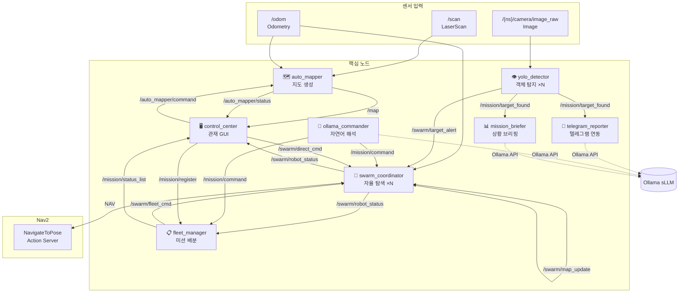

<div align="center">

# 🤖 Pinky: Autonomous Swarm Search & Rescue System

**ROS 2-based Multi-Robot Autonomous Exploration & Fleet Management System**

[](https://docs.ros.org/en/humble/)
[](https://www.python.org/)
[](LICENSE)
[](https://www.raspberrypi.com/)

[Quick Start](#-quick-start) · [Architecture](#-system-architecture) · [Node Details](#-node-details) · [Troubleshooting](#-field-troubleshooting--safety) · [Installation](#-installation)

</div>

---

## 📌 Key Features (주요 기능)

| Feature | Description |
|------|------|
| 🗺️ **SLAM-free Mapping** | Real-time OccupancyGrid generation using only LiDAR + Odometry (Optimized for Edge devices). |
| 🤖 **Swarm Exploration** | Collaborative area-partitioned exploration for N robots using BFS + Nav2. |
| 🎯 **Mission Management** | Map-based click-to-assign mission dispatching for search & rescue scenarios. |
| 💬 **NLP Control** | Translates natural language (Korean/English) to robot commands via local sLLM (Ollama). |
| 📱 **Telegram Integration** | Automated field reporting with photos + coordinates and remote manual overrides. |
| 🖥️ **Fleet Control UI** | Integrated dashboard for real-time swarm status and mission monitoring (Matplotlib). |
| 👁️ **YOLOv8 Detection** | Real-time detection of people/dogs/cats with swarm-wide synchronized alerts. |

---

## ⚡ Quick Start (빠른 시작)

```bash
# 1. Clone Repository
git clone [https://github.com/](https://github.com/)<your-org>/pinky_MapAutoLearning_Control.git
cd pinky_MapAutoLearning_Control/pinky/pinky_pro

# 2. Build & Source
source /opt/ros/humble/setup.bash
colcon build --symlink-install --packages-select pinky_mission
source install/setup.bash

# 3. Launch System (Swarm of 2)
ros2 launch pinky_mission mission_launch.py \
    bot_token:=YOUR_TELEGRAM_TOKEN \
    chat_id:=YOUR_CHAT_ID
```

---

## 🏗️ 시스템 아키텍처




📦 Node Details (노드 상세)
🗺️ auto_mapper (SLAM-free Mapping)
Generates an OccupancyGrid directly from LiDAR data using the Bresenham ray-casting algorithm.

Design Philosophy: Optimized for low-power SBCs (Raspberry Pi 4/5) by removing the computational overhead of standard SLAM packages (Cartographer/Gmapping).

🤖 swarm_coordinator (13-State Machine)
Manages individual robot behavior through a robust finite state machine (FSM).

Navigation: Uses BFS (Breadth-First Search) to identify frontier cells and Nav2 for path planning.

State Transition: SEARCHING → NAVIGATING → AT_BASE → EMERGENCY_STOP.

📋 fleet_manager (Fleet Optimization)
Balances mission assignments based on distance and battery levels. Automatically commands low-battery robots to return to base during active missions.

🛠️ Field Troubleshooting & Safety (현장 대응 및 안전)
OSARO Recruitment Note: This project emphasizes field-ready reliability and structured error handling.

Hardware-Software Fail-safe:

Implemented a dual-layer emergency stop: Software-triggered (LiDAR proximity) and Remote-triggered (Telegram/GUI).

Resource Management:

Optimized YOLOv8 inference to maintain 10+ FPS on Raspberry Pi 4 by leveraging asynchronous processing.

Communication Robustness:

Designed a JSON-based lightweight heartbeat protocol to ensure swarm synchronization even in unstable Wi-Fi environments (Warehouse-like settings).

🗂️ Custom 12-bit Grid Addressing System
To minimize communication latency, each 64×64 grid cell is represented by a unique 12-bit address [XY]-[XY]:

Format: [High 3-bits][Low 3-bits] using character mapping A(000) to H(111).

Benefit: Reduces coordinate data size by 60% compared to sending raw float values, ensuring faster swarm-wide updates.

🚀 Installation & Requirements
OS: Ubuntu 22.04 / Raspberry Pi OS (64-bit)

ROS 2: Humble Hawksbill

Core Dependencies: nav2-bringup, ultralytics (YOLOv8), ollama, python3-colcon-common-extensions

Bash
# Install Dependencies
sudo apt install -y ros-humble-nav2-bringup ros-humble-tf-transformations
pip install numpy ultralytics requests
🤝 Contributing & Maintenance
This repository follows Conventional Commits for clear version history:

feat: New features

fix: Bug fixes (Hardware/Software)

docs: Documentation updates

Pinky Team · GitHub Profile
Autonomous Swarm Robotics for Search & Rescue
